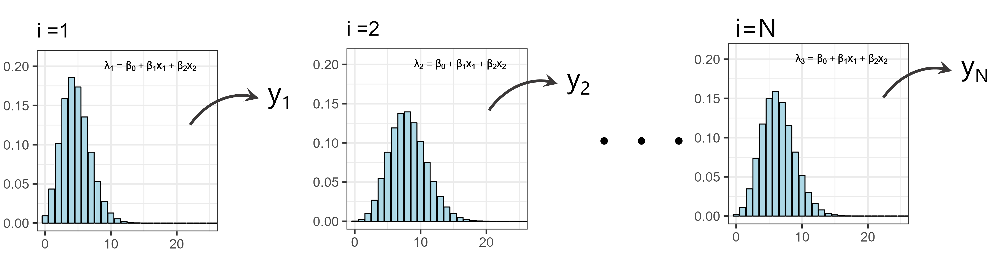

# 一般化線形モデルの基礎  
## 一般化線形モデルとは  
一般化線形モデル(GLM)は興味の対象である変数(= **応答変数**)が、影響を与えると想定される他の変数(= **説明変数**)とどのように関連しているのかを調べる分析です。「**一般化**」とつくのは、GLMがモデルの確率過程として正規分布以外の分布も扱うことができるからです。    

## GLMの3要素  
GLMは一般に次の3要素で表されます。    

1. **確率分布**    
「応答変数がどのような確率過程で得られているのか」を記述するために必要な部分です。確率分布の詳細については、第\@ref(c3)章を参照。応答変数がどのような種類のデータかによって異なる分布を用います。例えば、正の値も負の値も取る連続値(e.g., 気温)ならば正規分布、正の値のみをとる連続値(e.g., 体重)ならばガンマ分布、上限のない正の整数値(e.g., 何かの発生回数)ならばポワソン分布、上限のある整数値や割合データ(e.g., 10回コインを投げて表が出る回数)ならば二項分布を用います。     

ある確率分布から確率変数が得られていることを表現するとき、通常$\sim$という記号を使います。例えば、応答変数$y_i$が平均$\mu_i$、標準偏差$\sigma$の正規分布から得られていると仮定するとき、以下のように書けます。$i$は何番目のデータであるかを表します。    

$$
y_i \sim Normal(\mu_i, \sigma) \;\;\;(i = 1,2,\dots, N)
$$

2. **線形予測子**    
線形予測子とは、説明変数の線形結合したものです。$x_1, x_2, \dots x_n$を説明変数とするとき以下のように表されます。$\beta_0$は**切片**(intercept)、$\beta_1, \dots \beta_n$は**回帰係数**(coefficient)と呼ばれます。     

$$
\beta_0 + \beta_1 \times x_1 + \beta_2 \times x_2 + \dots \beta_n \times x_n 
$$

3. **リンク関数**    
応答変数と線形予測子を関連付けるための関数を**リンク関数**と呼びます。例えば、確率分布の期待値$\mu_i$と線形予測子をリンク関数$g()$で関連付けるとき、以下のように書きます。  

$$
g(\mu_i) = \beta_0 + \beta_1x_{1i} + \beta_2x_{2i} + \cdots
$$

リンク数の必要性を理解するためには、実際に様々な分布で統計モデルを書いてみるのが一番です。正規分布の場合、通常リンク関数には**恒等関数**が用いられます。聞きなれないかもしれませんが、恒等関数は入力した値に何も変換を施さない関数です。つまり、正規分布を用いたモデルでは、期待値$\mu_i$と線形予測子の関係と、応答変数$y_i$が得られる確率過程は以下のように書けます(\@ref(eq:glm-norm))。    

$$
\begin{aligned}
&y_i \sim Normal(\mu_i, \sigma)\\
&\mu_i = \beta_0 + \beta_1x_{1i} + \beta_2x_{2i} + \cdots　
\end{aligned}
(\#eq:glm-norm)
$$

これは問題がないでしょう。なぜなら正規分布は$-\infty < y_i < \infty$の値をとることができるので、$\mu_i$はどのような値でも取ることができるからです。  

しかし、他の分布では話が変わってきます。ここではポワソン分布を用いたモデルを考えてみましょう。例えば、期待値$\lambda$と線形予測子を恒等関数で関連付けるとき、以下のように書けます(\@ref(eq:glm-pois-identity)))。  

$$
\lambda_i = \beta_0 + \beta_1x_{1i} + \beta_2x_{2i} + \cdots (\#eq:glm-pois-identity)
$$

一見これは問題がなさそうですが、<u>ポワソン分布において$\lambda$は正の値しか取り得ない</u>ことを思い出してください。このままだと上式(\@ref(eq:glm-pois-identity))の右辺はどのような値も取り得てしまい、モデルがうまく推定できません。そこで、通常ポワソン分布を用いるときは$log()$をリンク関数に用います(\@ref(eq:glm-pois-log))。こうすることで、<u>右辺は正の値しか取り得なくなり、うまくモデリングすることができます</u>。これはガンマ分布や負の二項分布を用いるときも同様です。    

$$
\begin{aligned}
&y_i \sim Poisson(\lambda_i)\\
&log(\lambda_i) = \beta_0 + \beta_1x_{1i} + \beta_2x_{2i} + \cdots
\end{aligned}
(\#eq:glm-pois-log)
$$

それでは、二項分布を用いる場合はどうでしょう。二項分布は通常パラメータ$p$と線形予測子を関係づけますが、$p$は0から1までの値しか取り得ません。そこで、通常二項分布を用いるモデルではロジット関数をリンク関数に用います(\@ref(eq:glm-binom))。こうすることで、右辺は0から1の値までしか取り得なくなります。    

$$
\begin{aligned}
&y_i \sim Binomial(p_i, n_i)\\
&logit(p_i) = log \bigl( \frac{p_i}{1-p_i} \bigl) = \beta_0 + \beta_1x_{1i} + \beta_2x_{2i} + \cdots
\end{aligned}
(\#eq:glm-binom)
$$

通常用いられるリンク関数をまとめたのが以下の表です(表\@ref(tab:tab-link))。  
<br/>  

```{r tab-link, echo = FALSE}
data.frame(分布 = c("正規分布", "二項分布","ベータ二項分布", "ポワソン分布", "負の二項分布", "ガンマ分布"),
           よく使うリンク関数 = c("identity","logit","logit","log","log", "log")) %>% 
  kable(digits = 2, align = "c", caption = "各確率分布でよく使われるリンク関数") %>% 
  kable_styling(font_size = 13, full_width = FALSE)   
```

## GLMの模式図    
以上の3つの要素を使えば、GLMがどのようにモデリングを行っているかを理解することができます。例えば、応答変数が$y_i$で説明変数が2つ($x_1$,$x_2$)がある場合を考えます。$y_i$が上限のない正の整数値をとり、リンク関数をlog関数とするとき、モデルは以下のように書けます。ただし、データ数がNのとき、$i = 1,2,\dots,N$です。これがGLMの**モデル式**です。      

$$
\begin{aligned}
&y_i \sim Poisson(\lambda_i)\\
&log(\lambda_i) = \beta_0 + \beta_1x_{1i} + \beta_2x_{2i} 
\end{aligned}
(\#eq:glm-pois-ex)
$$

これを模式的に書くとすると、以下のようになります。モデルでは、各$i$番目の説明変数($x_{1i},x_{2i}$)ごとに$\lambda_i$の値が決まり、その$\lambda_i$をパラメータに持つポワソン分布から応答変数$y_i$が得られ、それを$N$番目までやることでデータが得られた、と仮定していることになります。  

```{r female-in, out.width = "100%", fig.align = "center", echo = FALSE, fig.cap = "GLMの模式図"}

```

