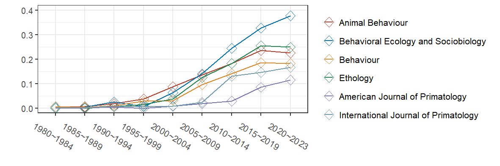

# 本稿の目的    
## なぜGLMやGLMMについて学ぶ必要があるのか？    
近年、生態学や動物行動学をはじめ、複雑な生物学のデータを解析する手法が発達してきている[@Harrison2018]。これは、従来のシンプルな統計手法(e.g. t検定、カイ二乗検定、線形回帰など)では、これらの分野で扱う複雑なデータを分析するには不適切であることが分かってきているからである。様々な分析のなかでも、**一般化線形モデル(GLM)**や**一般化線形混合モデル(GLMM)**と呼ばれる分析手法は、2000年代以降急速に用いられるようになってきた。下図は、Google Scholarを用いて、動物行動学・生態学・霊長類学の分野で著名な学術雑誌において、"GLM"または"GLMM"という単語が出てきた論文の割合を示したものである(2023年1月7日時点)。私たちが普段読む/投稿することが多いこれらの雑誌においても、2000年代以降これらの分析手法が数多く使われるようになってきたことが示唆される。

  

このことから、<u>自分が適切にデータ分析を行うためだけでなく、他の研究者による論文を適切に理解するためにもGLM/GLMMについて理解することは重要</u>であるといえる。しかし、多くの研究者は分析について適切に理解しないままその論文を引用したり、自身の研究に用いてしまっているのが現状ではないだろうか。分析について理解できていなければ、仮に論文の著者が分析を誤用していたり、分析結果を誤って解釈していたりしても(実際にそのような論文はある)、論文の内容を鵜呑みしてしまうことになりかねない。これは大きな問題である。本稿の目的は、**GLM/GLMMが用いられた分析結果について適切に理解できるようになる**ことに加え、可能であれば**Rを用いて自身のデータについてもGLM/GLMMを用いた分析ができるようになる**ことである。  

## 本稿で扱う内容   
本稿で扱うのは、以下の内容である。

- 社会ネットワーク分析の概要(第\@ref(c1)章)
- rawデータからマトリックス(隣接行列)を作成する方法(第\@ref(c2)章)  
- 各ネットワーク指標の解説と算出法(第\@ref(c3)章)   
- ネットワークデータでの統計分析（第\@ref(c4)章)  
